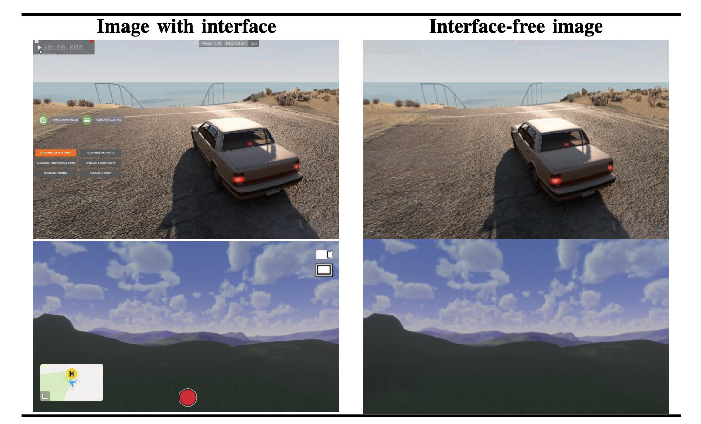

# :art: Deep Learning UI Removal Framework

Source code for UI removal paper, involving creating a 3D scene for UI removal.

## :open_file_folder: Structure

| Path | Description |
| --- | --- |
| [`3d-scene`](simulation) | 3D static scene display written in [_Rust_](https://www.rust-lang.org/). Primarily done to provide the neural network with the training data of backgrounds from different perspectives. Based on the [_Bevy_](https://bevyengine.org/) game engine. |
| [`framework`](framework) | Framework for training, evaluating, and using two neural networks: _YOLO_ and _DeepFillV2_. |
| [`meta`](meta) | Folder for source images for `README` files and such. |
